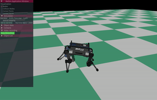
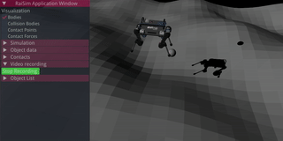
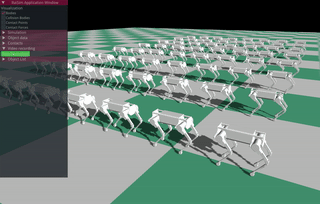
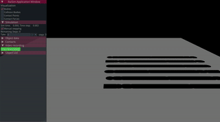

# raisimOgre: Visualizer for raisim

## What is raisimOgre?
raisimOgre is a visualizer for raisim. It is a simple wrapper around Ogre3d (https://www.ogre3d.org/), which is an open-source 3d rendering library.

## News
- 2019/12/18 Major code clean-up + light refactoring by Vasilios. You can now create multiple light sources.
- Now you can make simple graphs in raisimOgre using imgui + imgui_plot

- 2019/10/16, please pull ogre. I reported a skybox bug to ogre and added my fix to the forked repository.
- Mesh functionality added in RAISIM. Now RAISIM can simulate any trimesh (including non-convex ones).


## Requirements
- Linux only. support ubuntu 16.04 and 18.04 but might work on other distributions
- g++, gcc > 6 ([how to install?](https://github.com/jhwangbo/raisimHelp/tree/master#how-to-install-latest-version-of-g))
- cmake > 3.10 ([how to install?](https://github.com/jhwangbo/raisimHelp/tree/master#how-to-install-cmake))

## Related repos
- [raisimLib](https://github.com/leggedrobotics/raisimLib): the physics engine
- [raisimGym](https://github.com/leggedrobotics/raisimGym): a few gym environments using RAISIM
- [raisimPy](https://github.com/robotlearn/raisimpy): a (third-party) python wrapper of RAISIM

## Install
Please install/save everything locally to prevent corrupting your system files. We will assume that you have a single workspace where you save all repos related to raisim. Here we introduce two variables

- WORKSPACE: workspace where you clone your git repos
- LOCAL_BUILD: build directory where you install exported cmake libraries

To link against shared libraries in LOCAL_BUILD, you have to let LDD know where the libraries are installed. This can be done adding the following line to your ```~/bashrc```

```commandline
export LD_LIBRARY_PATH=$LD_LIBRARY_PATH:$LOCAL_BUILD/lib
```

If you are using an IDE, ensure that it loads your bashrc. For Clion (which is the recommended IDE) users, the instruction can be found [here](https://github.com/jhwangbo/raisimHelp/blob/master/README.md#how-to-use-variables-defined-in-your-bashrc-in-clion).

If you have g++ >= 6.0 installed, you can switch your active compiler by
```commandline
export CXX=/usr/bin/g++-8 && export CC=/usr/bin/gcc-8
```

### Dependencies
First, install raisimLib (https://github.com/leggedrobotics/raisimLib).

Then, install dependencies of Ogre.
```commandline
sudo apt-get install libgles2-mesa-dev libxt-dev libxaw7-dev libsdl2-dev libzzip-dev libfreeimage-dev libfreetype6-dev libpugixml-dev
```

Now build Ogre from source. Make sure that you install it locally since otherwise it will overwrite your system ogre installation.
```commandline
cd $WORKSPACE
git clone https://github.com/leggedrobotics/ogre.git
cd ogre
git checkout raisimOgre
mkdir build
cd build
cmake .. -DCMAKE_BUILD_TYPE=Release -DCMAKE_INSTALL_PREFIX=$LOCAL_BUILD -DOGRE_BUILD_COMPONENT_BITES=ON -OGRE_BUILD_COMPONENT_JAVA=OFF -DOGRE_BUILD_DEPENDENCIES=OFF -DOGRE_BUILD_SAMPLES=False

make install -j8
```

### raisimOgre
Finally, build raisimOgre (assuming that you already have cloned this repo).
```commandline
cd $WORKSPACE
cd raisimOgre && mkdir build && cd build
cmake .. -DCMAKE_BUILD_TYPE=Release -DCMAKE_PREFIX_PATH=$LOCAL_BUILD -DCMAKE_INSTALL_PREFIX=$LOCAL_BUILD -DRAISIM_OGRE_EXAMPLES=ON
make install -j8
```

### Optional Dependencies
- ffmpeg (video recording, for OgreVis::startRecordingVideo method. The install instruction can be found at https://tecadmin.net/install-ffmpeg-on-linux/)

## Examples
If you want to build examples, you can enable them by setting -DRAISIM_OGRE_EXAMPLES=ON (as above build description).

The executables are located in the examples folder in the build directory. Some examples do not start automatically. You should start simulation by unchecking "Simulation/Manual stepping" in the control panel.

anymalOnHeightMap



laikago



primitives



newtonsCradle


## OGRE Resources
1. Basic RaisimOgre resources are defined by the `RAISIM_OGRE_RESOURCE_DIR` macro.
2. Ogre resources are loaded from the resource file, whose location is defined by the `OGRE_CONFIG_DIR` macro.
3. The two aforementioned definitions are defined in the config file.

## How to contribute?
Please fork the repo, make changes and then send a pull request. Instructions can be found [here](https://help.github.com/en/articles/creating-a-pull-request-from-a-fork)

## Available materials
Check rsc/material for a few examples of pbr materials. 
Basic color materials can be found [here](https://www.rapidtables.com/web/color/RGB_Color.html). Replace spaces in the name by "_", e.g., "dark red" to "dark_red"

## Who made RaiSimOgre?
Jemin Hwangbo developed raisimOgre with the help of the following contributors

- Vassilios Tsounis

